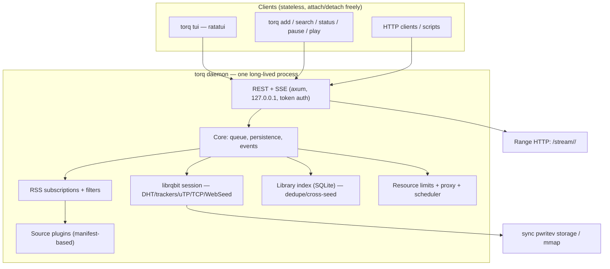

# TorQ — plan

> Status: **all phases shipped in v0.1.0** (daemon core, sources, TUI, RSS,
> streaming, controls, cross-seed, packaging). This is the design record;
> the implemented surface is in [README.md](README.md). Distribution:
> crates.io (`torqtui`), GitHub Releases + `torq update` manifest, Homebrew
> tap (`saswatsusmoy/torq`), `install.sh`. Releases are manual (no CI).

A torlink alternative: terminal + API torrent finder/downloader, rebuilt in Rust for
performance and resource efficiency, with a daemon/client architecture and a feature
set beyond what torlink ships.

## Why this beats torlink

torlink (v1.6.0) is polished but architecturally capped: Node ≥22 runtime (~100MB+),
WebTorrent (JS engine, memory-hungry, single-threaded), TUI-or-headless modes with a
tmux hack for reattach, 10 hardcoded scrapers, no RSS subscriptions, no proxy, no
streaming, no per-torrent controls.

TorQ: one ~11MB binary, zero runtime deps, a long-lived daemon owning the
engine with thin stateless clients (TUI, CLI, REST), and every feature below built
into the daemon.

## Stack (decided)

- **Rust** (edition 2024, rustc 1.91, MSRV 1.85) — single static binary, no GC, mmap-able disk I/O
- **librqbit 8.1.1** (crates.io stable, `rust-tls` feature — no openssl) — pure-Rust
  BitTorrent engine: DHT, trackers, uTP, TCP, WebSeed, PEX, LSD, SOCKS5 proxy,
  per-torrent + session rate limits, sequential streaming with HTTP range, JSON
  session persistence, file selection
- **axum** — REST + SSE API on 127.0.0.1 with token auth
- **ratatui + crossterm** — TUI client
- **reqwest (rustls, socks)** — HTTP for sources, trackers, and proxy support
- **scraper** — HTML extraction for the sites that need it (1337x)
- Library/cross-seed index: in-memory infohash map built by scanning `.torrent`
  dirs (librqbit-core parse), rebuilt on demand — deliberately no SQLite

## Architecture



- No tmux hack: daemon owns the engine; reattach = reconnect. Multiple TUIs attach.
- Crates: `torq-core` (daemon: engine wrapper, queue, persistence, API),
  `torq-sources` (adapters + plugin engine), `torq-tui` (ratatui), `torqtui`
  (binary crate; the `torq` name was taken on crates.io, the command stays `torq`).
- Config: `config.toml` (download dir, trackers, limits, proxy, auth token, plugins).
  State: librqbit JSON persistence (session + have-bitfields); queue/subscriptions
  metadata in JSON; the cross-seed index is rebuilt by scanning on demand.
- Plugins: TOML manifests — "RSS feed + item mapping" or "JSON-API endpoint + field
  map". No scripting runtime, no headless browser. Built-ins: the 10 torlink
  sources ported to Rust.

## API surface (v1, implemented)

```
GET  /health                          daemon alive + version
GET  /events                          SSE stream of queue/torrent events
GET  /torrents                        list + status
POST /torrents                        add (magnet / infohash / torrent_b64)
DELETE /torrents/{id}                 remove (?delete_files=1)
POST /torrents/{id}/pause|resume
GET  /torrents/{id}/files
GET  /torrents/{id}/stream/{file}     range HTTP (in-progress OK, sequential)
GET  /search?q=&sources=...           aggregated, deduped by infohash
GET/POST/DELETE /rss                  subscriptions (filters, autodownload)
GET/POST /library                     cross-seed index (scan on demand)
PATCH /config/limits                  live rate limits
```

Auth: bearer token generated on first daemon start, stored in config; TUI/CLI read it
from the config file (local trust). All binds on 127.0.0.1.

## Performance targets

| Metric | Target |
|---|---|
| Binary size | ≤ 15MB stripped |
| Idle RSS | < 40MB (daemon) |
| Idle CPU | ~0% (event-driven, amortized DHT) |
| TUI attach | < 100ms |
| Library | 1000 torrents responsive, virtualized TUI lists |
| Active downloads | 3–5 default slots, rest queued (torlink model) |
| Disk I/O | sync pwritev (librqbit default), zero-copy; mmap optional |

## Build order (all shipped in v0.1.0)

1. ~~Spike~~ — done, see [docs/SPIKE.md](docs/SPIKE.md)
2. ~~Daemon core~~: engine session, add/remove, queue slots, persistence, REST+SSE,
   token auth, watch-folder (notify). torlink's `watch`/`serve` folds in here.
3. ~~Sources~~: port 10 adapters, plugin manifests, aggregated search + infohash dedupe.
4. ~~TUI~~: torlink-parity panes (browse/search/downloads), keymap, attach/detach.
5. ~~RSS + autodownload~~: subscriptions, regex/size filters, jittered polling.
6. ~~Streaming~~: sequential download (FileStream), range HTTP, `torq play`.
7. ~~Resource controls + proxy~~: caps (librqbit ratelimits), bandwidth scheduler,
   SOCKS5 (librqbit `socks_proxy_url` + reqwest proxy for HTTP).
8. ~~Cross-seed~~: library scan, infohash match, output routing to existing data.
9. ~~Packaging~~: release builds, self-update (manifest + atomic swap), launchd agent,
   README, install.sh, Homebrew tap, crates.io publish.

## Testing

- Unit tests per crate (cargo test): queue state machine, persistence round-trips,
  dedupe, filter matching, RSS parsing, config, schedule windows, library scan.
- E2E per phase against the real daemon and live network (documented in commit
  messages): add → download → stream ranges → pause → remove; RSS autodownload;
  cross-seed routing; installer + self-update against real releases.

## Risks (spike-resolved)

- SOCKS5 for peer traffic: **supported** (`ConnectionOptions.proxy_url`, all outgoing
  connections; reqwest proxy for HTTP). Risk retired.
- Sequential download for streaming: **supported** (`FileStream`, AsyncRead+AsyncSeek,
  32MB lookahead, HTTP range handler). Risk retired.
- Site reachability: 5/8 sources verified live; YTS/EZTV/1337x DNS-blocked from this
  network (sinkhole IP) — port proceeds from torlink's working adapters with
  multi-host failover; same outage affects torlink today.
- librqbit 8.1.1 vs 9.0.0-rc: source verified at HEAD (9.0.0-rc, commit 4e5f94cb);
  pin 8.1.1 and re-verify APIs compile in daemon-core phase.
